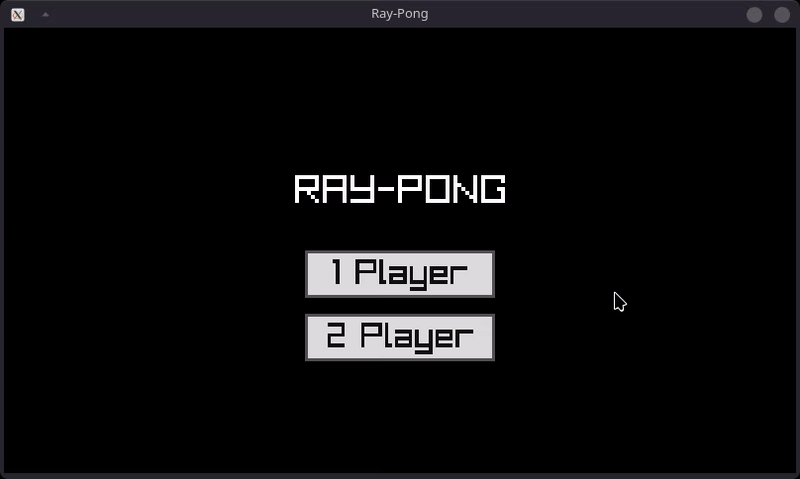
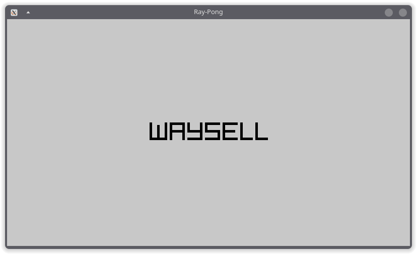
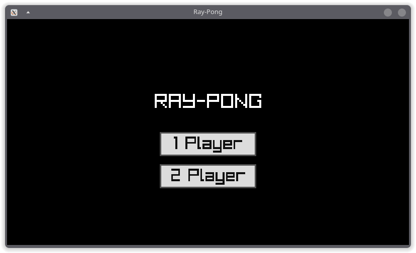
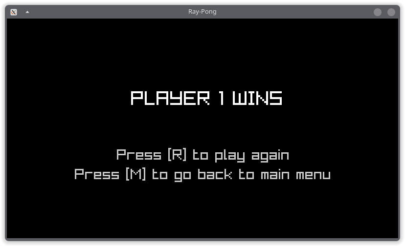

# Ray-Pong

A lightweight, 2D implementation of the classic Pong game, built from scratch in **C** using the **Raylib** library




## Features
*   **Game Modes:** Play against a friend (2-player) or challenge the AI (1-player)
*   **Menu System:** Intuitive main menu to select game modes.
*   **Dynamic Gameplay:** Includes score tracking, ball speed acceleration, and win/loss states.
*   **Simple Controls:** Easy-to-use keyboard inputs for both players.

## Prerequisites
To compile and run this game, you need the **Raylib** library installed on your system.

## Controls
*   **Player 1:** `W` (Up) / `S` (Down)
*   **Player 2:** `Up Arrow` / `Down Arrow`
*   **Game Management:** 
    *   `R` to restart during the ending screen
    *   `M` to return to the main menu

## How to Build and Run
This project includes a `Makefile` for easy compilation.

1. **Clone the repository** and navigate to the project folder.
2. **Build the game:**
   ```bash
   make build
   ```
3. **Run the game:**
   ```bash
   make run
   ```
4. **Cleanup:** To remove the executable, use:
   ```bash
   make clean
   ```


   ## 📸 Screenshots


### Logo Screen


### Main Menu


### Game Over Screen
